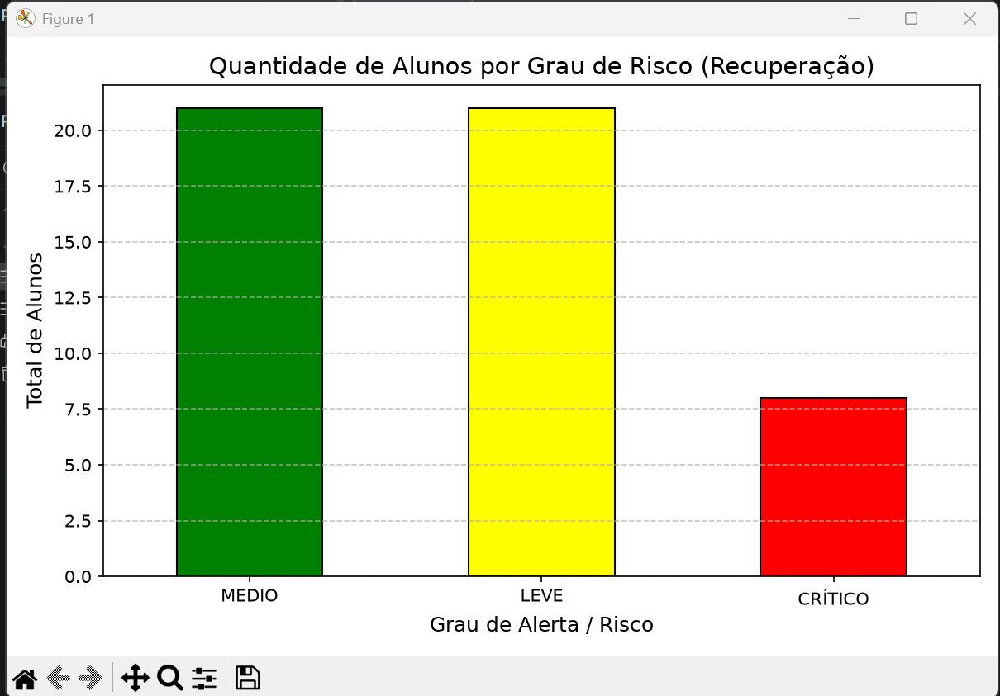

# School Data Analytics

> > Ferramenta CLI para automatizar a identificação de alunos em recuperação 
> e classificar o grau de risco acadêmico a partir de dados escolares.

<p align="left">
  
  
  
  
  
</p>

---

##  Sobre o Projeto

Instituições de ensino investem muito tempo ao final de cada período letivo consolidando dados de notas manuais para identificar estudantes que necessitam de apoio pedagógico.

O **School Data Analytics** foi desenvolvido para automatizar a leitura dos dados escolares, filtrando alunos em situação de recuperação, calculando o grau de risco/criticidade de cada estudante e gerando visualizações gráficas que auxiliam coordenadores e professores na tomada de decisão rápida e precisa.

---

##  Funcionalidades Atuais

- **Filtragem Dinâmica**: Identifica alunos com nota abaixo da média estipulada (ex: `< 6.0`).
- **Classificação de Criticidade**: Agrupa alunos por grau de risco (*LEVE*, *MÉDIO* e *CRÍTICO*) com base na quantidade de disciplinas em recuperação.
- **Visualização Gráfica**: Gera gráficos de barras estilizados via Matplotlib para rápida interpretação pedagógica.
- **Comparativo Bimestral**: Compara percentuais de recuperação e média de matérias pendentes entre diferentes bimestres.
- **Interface CLI Interativa**: Menu simples e guiado via terminal para navegação do usuário.

---

##  O que NÃO faz (ainda)

- Não lê exportações reais do Activesoft sem tratamento manual prévio 
  (dados de entrada precisam seguir o formato do CSV de exemplo)
- Não possui interface gráfica — uso via terminal
- Não persiste dados entre sessões além dos relatórios exportados

---

##  Aviso sobre dados e privacidade
Este projeto usa dados fictícios para fins de demonstração. Não deve ser 
usado com dados reais de estudantes sem anonimização e controles de 
acesso adequados (LGPD).
---

##  Tecnologias Utilizadas

<p align="left">
  <a href="https://www.python.org/"></a>
  <a href="https://pandas.pydata.org/"></a>
  <a href="https://matplotlib.org/"></a>
  <a href="https://github.com/astral-sh/uv"></a>
  <a href="https://git-scm.com/"></a>
</p>

---

##  Estrutura do Projeto

```text
school-data-analytics/
├── dados/
│   ├── config.py                         # Configurações de caminhos de arquivos
│   └── alunos_fake_projeto_atualizado.csv # Base de dados de estudantes
├── imagens/                              # Imagens e gráficos gerados para a documentação
│   └── grafico_risco.png                 # Gráfico de exemplo do sistema
├── relatorios_gerados/                   # Exportação de relatórios salvos
├── src/
│   ├── filtros.py                        # Regras de negócio e cálculo de risco
│   ├── graficos.py                       # Módulo de renderização de gráficos Matplotlib
│   ├── interface.py                      # Menu interativo e fluxo principal
│   └── relatorios.py                     # Agrupamentos e estatísticas por bimestre
├── tests/                                # Testes automatizados do sistema
├── main.py                               # Ponto de entrada da aplicação
├── pyproject.toml                        # Gerenciamento de dependências
└── README.md                             # Documentação do projeto
```

---

##  Como Executar

### Pré-requisitos
- Python 3.10+ (ou gerenciador `uv`)
- Git

### 1. Clonar o repositório
```bash
git clone https://github.com/SeuUsuario/school-data-analytics.git
cd school-data-analytics
```

### 2. Configurar o Ambiente Virtual e Dependências

#### Opção A: Usando `uv` (Recomendado)
```bash
uv sync
```

#### Opção B: Usando `venv` + `pip`
```bash
# Criar o ambiente virtual
python -m venv .venv

# Ativar o ambiente virtual (Windows)
.venv\Scripts\activate

# Ativar o ambiente virtual (Linux / macOS)
source .venv/bin/activate

# Instalar dependências
pip install pandas matplotlib
```

### 3. Executar o sistema
```bash
python main.py
```

---

##  Visualização dos Dados

Abaixo está o gráfico gerado pelo sistema mostrando a quantidade de alunos por grau de risco (*MÉDIO*, *LEVE* e *CRÍTICO*):



---

###  Próximos passos (curto prazo)

- [ ] Testes automatizados com pytest para filtros.py e relatorios.py
- [ ] Exportação de relatórios em Excel com formatação condicional
- [ ] Tratamento robusto de inconsistências em exports reais (encoding, 
  colunas variáveis)
- [ ] Relatório de disciplina crítica: matéria com maior índice de recuperação por bimestre
- [ ] Relatório individual do aluno: evolução de desempenho ao longo dos bimestres

---

###  Visão de longo prazo (exploratório)

- [ ] Interface web (Streamlit)
- [ ] Geração assistida por IA de sugestões de diagnóstico pedagógico 
  (com revisão humana obrigatória antes de qualquer publicação)

---

##  Licença e Autor

Este projeto está sob a licença [MIT](LICENSE).

Desenvolvido por **Alex Sandro Rodrigues** 👋  
[GitHub](https://github.com/Alexsandro-coder) | [LinkedIn](https://www.linkedin.com/in/alex-sandro-rodrigues-rodrigues-nobre-junior-5468821b0/)